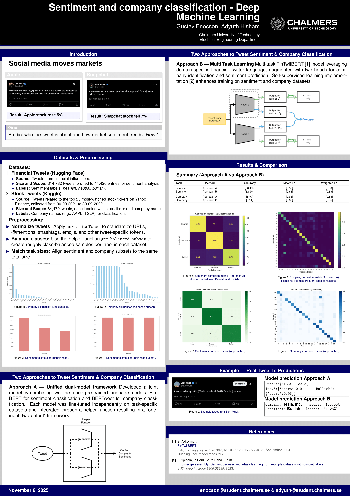

# Financial Tweet Classification

This project investigates the classification of financial tweets about publicly traded companies, focusing on two main tasks: **sentiment analysis** and **company identification**.

Tweets—especially from influential accounts or large volumes of similar posts—can significantly impact stock market behavior. Understanding these tweets can offer valuable insights into market sentiment and trends.

---

## Poster

[View Full Report (PDF)](Project_report.pdf)

---

## Approaches

### Approach A – Dual Model Fusion
- Fine-tuned **FinBERT** for sentiment analysis.  
- Fine-tuned **BERTweet** for company identification.  
- Combined their outputs using a **fusion mechanism**.

### Approach B – Multi-Task FinTwitBERT
- Extended a pre-trained **FinTwitBERT** model.  
- Added a **dual-head architecture** for simultaneous sentiment and company classification (one head fine-tuned, one trained from scratch).

<!-- ---

## Results

| Model / Task | Sentiment Accuracy | Company Accuracy |
|---------------|--------------------|------------------|
| **Approach A** | 80% | 67% |
| **Approach B** | **83%** | **68%** |

The multi-task model (Approach B) showed slightly better performance, suggesting that **joint learning** can improve accuracy and scalability for financial tweet analysis.

---

## Key Insight
Multi-task learning offers a promising way to monitor and understand the influence of social media on financial markets — enabling more efficient, scalable sentiment and entity recognition systems. -->
